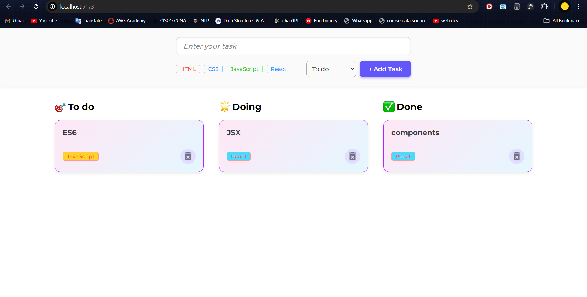

# Todo React App

This is a simple **Todo Application** built with **ReactJS** that allows users to organize their tasks by categorizing them into different stages: **Todo**, **Doing**, and **Done**. The tasks are displayed in a card format for easy visualization and interaction.

## Features
- **Add Task**: Enter tasks for different stages (**Todo**, **Doing**, **Done**).
- **Task Management**: Organize tasks by dragging or moving them to different categories.
- **Task Status**: Tasks can be moved between "Todo", "Doing", and "Done" sections.
- **Card Format**: Tasks are displayed in visually appealing card format.
- **Interactive UI**: Dynamic UI with a clean and responsive design.

## Tech Stack
- **ReactJS**: The core library used for building the user interface.
- **HTML**: To structure the app's content.
- **CSS**: For styling the components and making the app responsive.
- **JavaScript**: Provides the app's functionality and logic.

## ScreenShot

## Usage
 **Add a Task**
-     Use the input field to enter a task.
-     Click the "Add Task" button to save the task under the Todo category.
**Manage Tasks**
-     Tasks can be moved between categories (Todo, Doing, Done) by interacting with the UI (e.g., using buttons or drag-and-drop, if implemented).
**Task Display**
-     Each task is displayed as a card with its respective status.
-     You can mark tasks as completed or move them to other categories.
